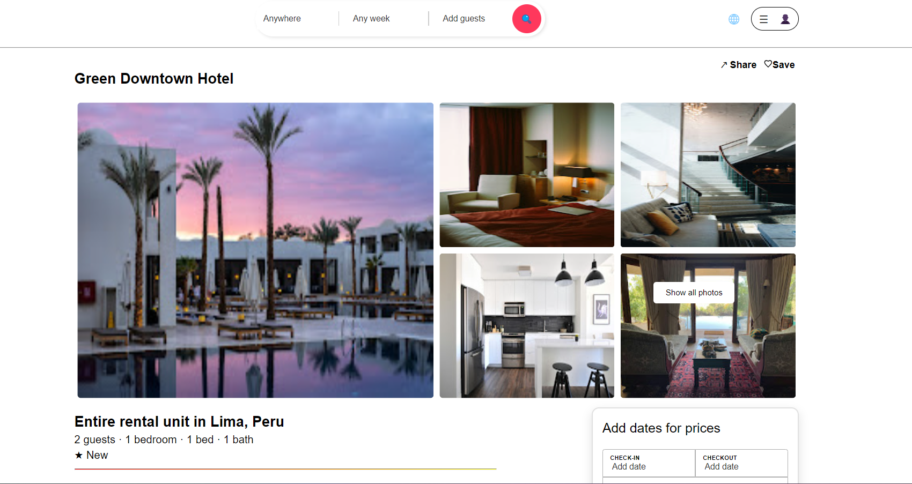
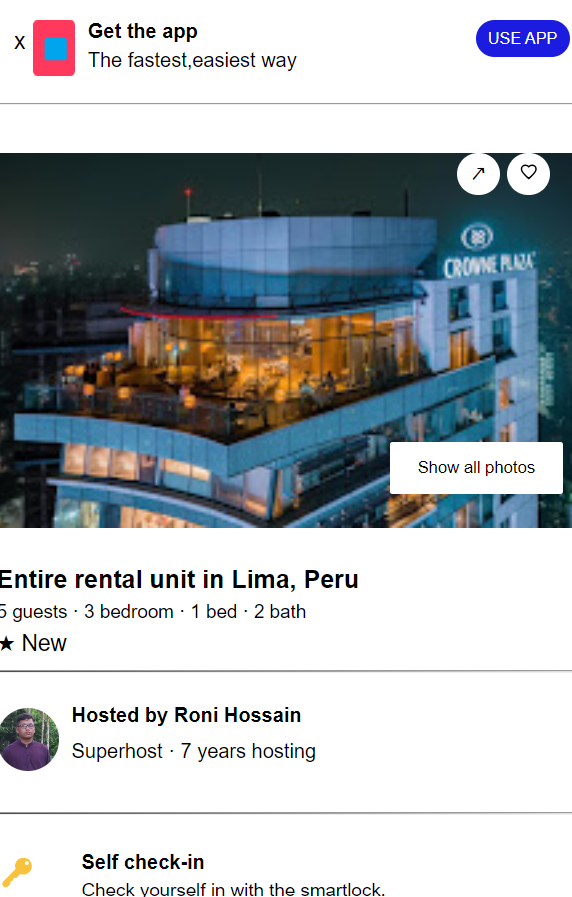

# Full Statck Assignment - Frontend
This is a full-stack site <span style="color: red">forntend</span> built using HTML, CSS, and React.js. It features various sections including an image gallery for showcasing hotel images, a host profile section to display host information, and a calendar for booking dates. An interactive navbar allows easy navigation, while the room section provides detailed room information. The footer includes additional links and contact information.

## Features
- Shimmer Effect.
- Responsive View
- Iterative Navigation menu
- Iterative calander
- Responsive design
- Beautiful host section
- Efficient schema design
- Proper comment & documentation


### Tools & Technology
This frontend part is built using following tools & technologies:

**HTML** : HTML (HyperText Markup Language) is the standard language used to create and structure content on the web. It provides the essential framework for web pages, allowing developers to define elements such as headings, paragraphs, images, and links.

**CSS** : CSS (Cascading Style Sheets) is used to style and layout web pages, controlling the visual presentation of HTML elements. It allows developers to apply fonts, colors, spacing, and responsive design to enhance user experience..

**React.js** : React.js is a JavaScript library for building dynamic user interfaces, enabling developers to create reusable UI components. It efficiently updates and renders components, making it ideal for building fast and interactive web applications.
**VsCode**: Visual Studio Code, also commonly referred to as VS Code, is a source-code editor developed by Microsoft for Windows, Linux, macOS and web browsers. Features include support for debugging, syntax highlighting, intelligent code completion, snippets, code refactoring, and embedded version control with Git. 


### Running the backend 
1. Clone the project
    ```bash
    git clone https://github.com/Md-Roni024/Full_Stack_Assignment
    ```  

2. Go to the project directory and install dependencies
    ```
    cd frontend
    npm install
    ```
3. Start the frontend
    ```
    npm start
    ```
    After successfully run the backend part it will launch in port 3000.

4. Testing URL:
    ```
    http://localhost:3000/hotel/Crowne-Plaza-Dhaka/
    ```
    This URL display the frontend.It's directly fetch data from PostgreSql database then render to the frontend.
    

### Screenshot
- Desktop View
  
- Mobile View
  
### Future Improvements
  - Add more functionality:

    In future I will add some more inteactive functionality where user can give ratings and review  to every hotels. Also can make report to hotel in any unwanted reason.

  - Notification System :

    The system notifies rectors instantly upon new complaints within their hostel blocks, facilitating swift response


### Contributing
- Contributions are welcome! Feel free to open issues or submit pull requests.


### Contact

- For any inquiries or feedback, please contact us at roni.cse024@gmail.com

